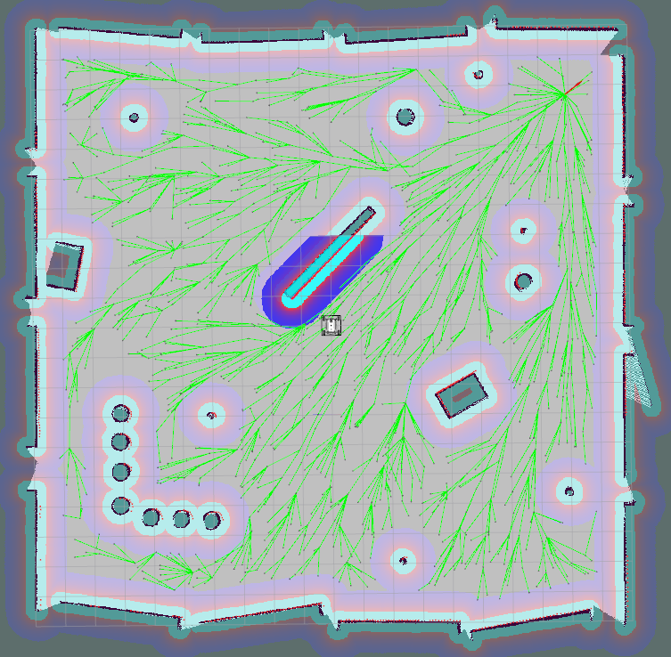

rrtx_global_planner
==============

Global path planner plugin based on RRTX algorithm for move_base package

About
-----

This package provides global path planner plugin based on [RRTX algorithm](http://ottelab.com/html_stuff/pdf_files/Otte.Frazzoli.IJRR15.pdf) for [move_base](http://wiki.ros.org/move_base) package.
The move_base package supports any global planner adhering to the nav_core::BaseGlobalPlanner interface specified in the nav_core package.
RRTx is an asymptotically optimal sampling-based replanning algorithm for dynamic environments where the obstacles unpredictably appears, disappears, or moves [1].




Attention
-----

1. This package can be used as global planner in [gazebo_navigation repository](https://github.com/kangbeenlee/gazebo_navigation.git).
Tip: [Writing A Global Path Planner As Plugin in ROS](http://wiki.ros.org/navigation/Tutorials/Writing%20A%20Global%20Path%20Planner%20As%20Plugin%20in%20ROS)
2. For simplicity, Algorithm 11 (removeObstacle) in RRTX is not applied in this code.
3. Due to delay in tree visualization, you should annotate publishTree() function in rrtx_planner_ros.cpp. If you wanna visualize shortest path sub-tree, then unannotate this function.
4. Optimization such as kdtrees is not applied.

Usage
-----

1. **Make your own workspace and build**

    To use this planner, check it out in your local catkin workspace:
    ```
    $ cd ~/catkin_ws/src
    $ git clone https://github.com/kangbeenlee/rrtx_global_planner.git
    $ cd ..
    $ catkin_make
    ```

2. **Place plugin as shared object**
    
    Now the planner should be placed as shared object in the devel/lib folder.
    List the plugin with the command:
    ```
    $ rospack plugins --attrib=plugin nav_core
    ```

3. **Use the plugin**
    
    After 2nd step, you can use this plugin together with the move_base node.
    Then, use the plugin in your move_base_parameters.yaml file:
    ```
    base_global_planner: rrtx_global_planner/RRTXPlanner
    ```

Reference
-----

[1] RRTX: Asymptotically Optimal Single-Query Sampling-Based Motion Planning with Quick Replanning. Michael Otte and Emilio Frazzoli. The International Journal of Robotics Research. Volume 29, Issue 7. 2016. p. 797-822.

[2] [RRTX code with the Julia programming language by Michael Otte](http://ottelab.com/html_stuff/code.html).